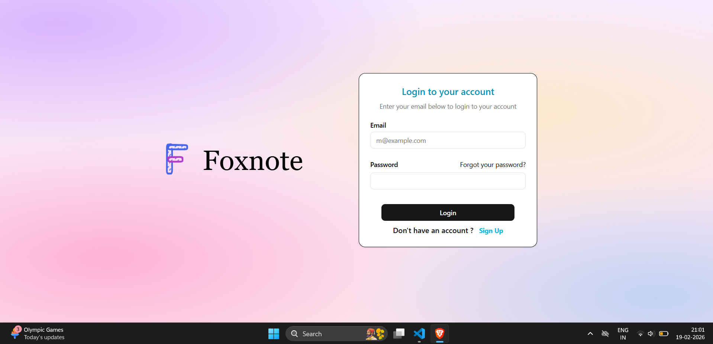

# MERN Note App

A fullstack web application for creating, editing, and managing personal notes. Built with the MERN stack (MongoDB, Express.js, React, Node.js) to demonstrate CRUD operations, user authentication, and responsive design.

[](./screenshots/dashboard.png)

## Features
- User registration and login with JWT authentication
- Create, read, update, delete (CRUD) notes
- Responsive UI for mobile and desktop
- Secure backend with environment variables for sensitive data

## Tech Stack
- **Frontend**: React, React Router, Axios (for API calls), Tailwind CSS (or your styling choice)
- **Backend**: Node.js, Express.js, MongoDB (with Mongoose), JWT for auth
- **Database**: MongoDB Atlas
- **Other**: CORS, dotenv for env management

## Installation and Setup
To run locally:

1. Clone the repo:


2. Install dependencies:
- Backend:
  ```
  cd backend
  npm install
  ```
- Frontend:
  ```
  cd ../frontend
  npm install
  ```

3. Set up environment variables:
- In `backend/`, create `.env` with:
  ```
  MONGO_URI=your_mongodb_connection_string
  JWT_SECRET=your_secret_key
  PORT=5000
  ```
- In `frontend/`, if needed, create `.env` for API base URL:
  ```
  REACT_APP_API_URL=http://localhost:5000
  ```

4. Run the app:
- Backend: `cd backend && npm start`
- Frontend: `cd frontend && npm start`
- Visit following port in your browser.

## Usage
- Sign up or log in.
- Add notes via the form.
- Edit or delete from the dashboard.
- Search notes in real-time.

## Screenshots
  
  

## Contributing
Fork the repo and submit a pull request for improvements!

## License
MIT License

---

Built by Abhishek Gupta. Check out my [Twitter(X)](https://https://x.com/abhhhhhiiiiii) or connect on [LinkedIn](https://www.linkedin.com/in/abhishek-gupta-1aa879307/).